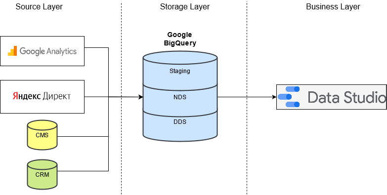
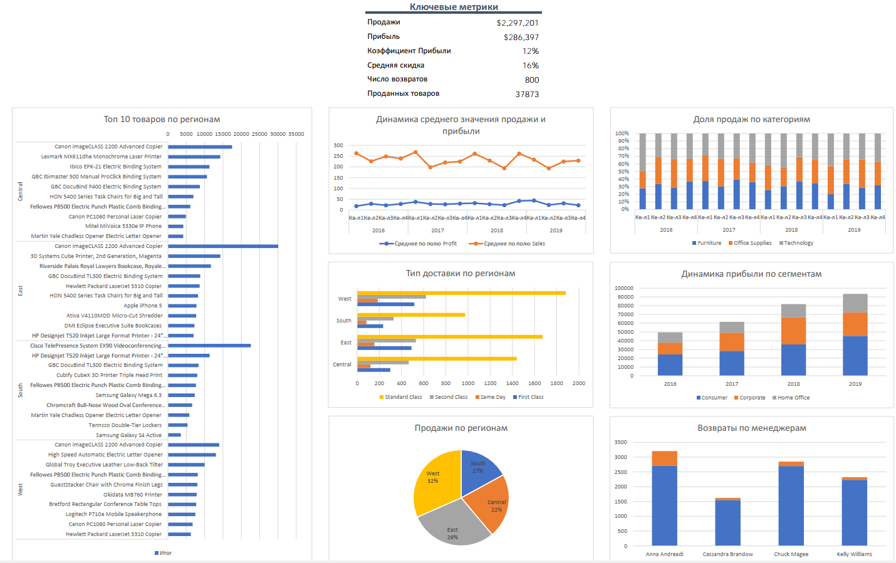

# Задачи
## Архитектура Аналитического Решения
Необходимо нарисовать верхнеуровневую архитектуру аналитического решения:
- Source Layer - слой источников данных
- Storage Layer - слой хранения данных 
- Business Layer - слой для доступа к данным бизнес пользователей

Необходимо использовать draw.io, Microsoft Visio Studio, Power Point или инструмент на выбор. 

## Аналитика в Excel
Используя данные [Sample - Superstore.xls](Sample - Superstore.xls) сделать:
- Использовать Lookup
- Построить Сводную таблицу
- Построить примеры отчетов
- Создать дашборд
- И другая функциональность Excel на ваш выбор.

