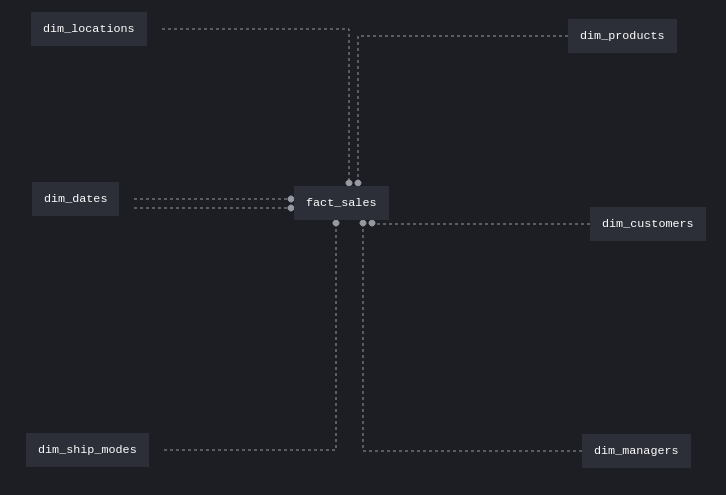
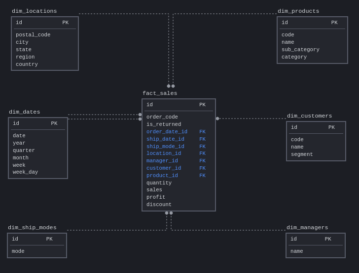
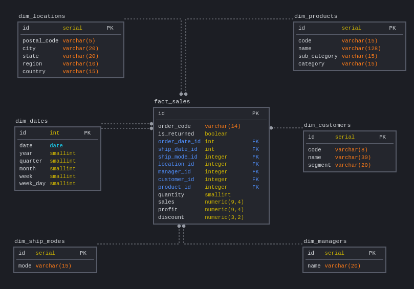
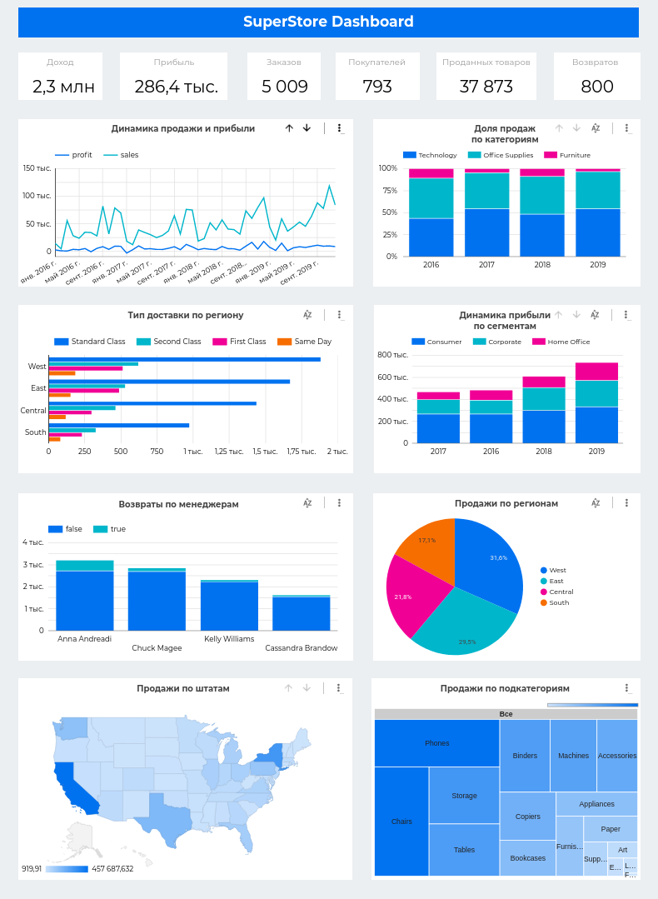

# Модуль 2

## 2.3: SQL запросы
1. Создайте 3 таблицы и загрузите данные из [Superstore Excel файла](../Module1/Sample%20-%20Superstore.xls) в вашу базу данных, используя подготовленные [скрипты](./2.3/stg).
2. Напишите [запросы](./2.3/queries.sql), чтобы ответить на вопросы из Модуля 01.

## 2.4: Модели Данных
1. Необходимо нарисовать модель данных (Dimensional Model) для нашего файлика [Superstore](../Module1/Sample%20-%20Superstore.xls):

- Концептуальную
  
  
- Логическую
  
  
- Физическую
  
  
  
Вы можете использовать бесплатную версию [SqlDBM](https://sqldbm.com/Home/) или любой другой софт для создания моделей данных баз данных.

2. Сгенерировать [SQL-скрипт](./2.4/ddl.sql) с DDL командами создания таблиц фактов и измерений. 
3. После создания таблиц, загрузить данные посредством `INSERT INTO SELECT` [запроса](./2.4/stg_to_dw.sql) из staging-таблиц.

## 2.5: База данных в облаке

1. Вам необходимо [создать учетную запись в AWS](https://github.com/Data-Learn/data-engineering/blob/master/how-to/How%20to%20create%20AWS%20Account.md).
2. Используя сервис AWS Lightsail или [AWS RDS (смотрите инструкцию)](https://github.com/Data-Learn/data-engineering/blob/master/how-to/how_to_amazon_rds.md) создайте БД Postgres и активируйте **Public access**
3. Подключитесь к новой БД через SQL клиент
4. Загрузите данные из модуля 2.3 (Superstore dataset) в staging (схема БД `stg`) и загрузите dimensional model (схема `dw`):

- Staging
  * [people.sql](./2.3/stg/people.sql)
  * [returns.sql](./2.3/stg/returns.sql)
  * [orders.sql](./2.3/stg/orders.sql)
- Business Layer
  * [ddl.sql](./2.4/ddl.sql)
  * [stg_to_dw.sql](./2.4/stg_to_dw.sql)
              
## 2.6: Как донести данные до бизнес-пользователя
Необходимо создать дашборд в одном из решений (Google Data Studio, AWS QuickSight, Klipfolio). Данные должны быть в Postgres в AWS и вы сможете подключиться сервисом к БД и создать несколько отчетов.
* [Дашборд в Google Data Studio с подключением к AWS RDS](https://datastudio.google.com/reporting/42e6beb3-9dcc-41e1-864e-b587995aca5a)

  