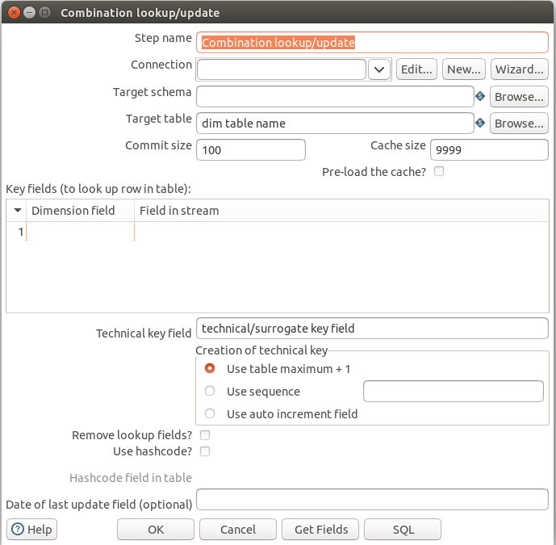
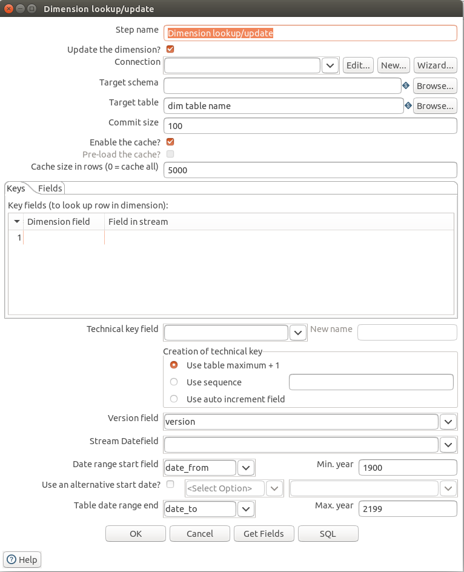

## Extracting System (#3)
Задача системы понять систему источник и уметь к ней подключиться, чтобы забирать данные.

В Pentaho DI существует множество шагов для извлечения данных, вот лишь несколько из них:

### [CSV file input](https://help.hitachivantara.com/Documentation/Pentaho/9.1/Products/CSV_File_Input)

Читает данные из текстовых файлов с разделителями. Есть возможность указать параметры парсинга (разделитель, кодировка и т.д.). Есть автоопределение полей (Get fields), а также возможность ручного описания полей.

### [JSON input](https://help.hitachivantara.com/Documentation/Pentaho/9.1/Products/JSON_Input)

Извлекает данные из различных JSON-структур (файлы либо входящие данных из предыдущих шагов) и преобразует их в записи, используй JSONPath-выражения.

### [Table Input](https://help.hitachivantara.com/Documentation/Pentaho/9.1/Products/Table_Input)

Читает информацию из различных баз данных при наличии соответствующего JDBC-драйвера. В запросах могут использоваться переменные, в том числе и из предыдущих шагов транформации.  
                             
## Error Event Handler (#5)
Задача системы отлавливать ошибки и принимать решения, что делать дальше, чтобы не сломать весь ETL процесс.

В Pentaho DI есть несколько шагов, позволяющих управлять потоком ошибок. Среди них валидация и фильтрация.

### [Data Validator](https://wiki.pentaho.com/display/EAI/Data+Validator)

Валидирует входящие данные с помощью набора правил. Среди правил: граничные условия, регулярные выражения, белый список, проверка на null. В исходящие данные будет помещено поле с указанием описания ошибок.

## Deduplication System (#7)
Задача системы выявлять дубликаты записей и устранять их.

### [Unique Rows](https://help.hitachivantara.com/Documentation/Pentaho/9.1/Products/Using_the_Unique_Rows_step_on_the_Pentaho_engine)

Удаляет дублирующиеся строки в отсортированных входных данных. Возможен поиск без учета регистра. Вместо удаления строк можно перенаправить дубли в поток ошибок.

## Surrogate Key Creation System (#10)
Задача системы генерить суррогатные ключи для наших натуральных ключей.

При первичной загрузке данных можно использовать шаг "Add Sequence".

### [Add Sequence](https://help.hitachivantara.com/Documentation/Pentaho/9.1/Products/Add_sequence)

Извлекает новое значение из последовательности. Можно использовать внутренний счетчик, указав начальное значение, максимальное значение и дельту, либо использовать последовательность из БД.

## Surrogate Key Pipeline (#14)
Задача системы использовать правильный суррогатный ключ при создании таблицы фактов.

### [Combination lookup-update](https://wiki.pentaho.com/display/EAI/Combination+lookup-update)

Помимо обновления измерений, может использоваться для поиска соответствующего суррогатного ключа по бизнес-ключу.

## Data Conformer (#8)
Задача системы согласовывать измерения и показатели из разных систем источников для использования их в отчетности.

### [Stream lookup](https://wiki.pentaho.com/display/EAI/Stream+Lookup)

Позволяет искать данные, используя информацию, полученную на других этапах трансформации. Данные, поступающие с шага-источника, сначала считываются в память, а затем используются для поиска данных из основного потока. Есть возможность указывать поля для извлечения.

## Late-Arriving Data Handler (#16)
Задача системы обрабатывать данные Dimemsion, которые появились позже. Обычно подходит для SCD 2-го типа.

### [Dimension lookup/update](https://wiki.pentaho.com/display/EAI/Dimension+Lookup-Update)

Обновляет измерения c SCD 2-го типа, так же используется для поиска по этому измерению.
При обновлении можно указывать поля для версии, поля для диапазона дат актуальности.
     
## Sort System (#28)
Задача системы упорядочивать строки.

### [Sort rows](https://help.hitachivantara.com/Documentation/Pentaho/9.1/Products/Sort_rows)

Упорядочивает строки по значениям полей по возрастанию или убыванию. Также позволяет убрать дубли, оставив только первое вхождение.

