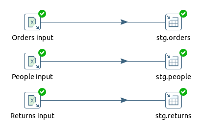
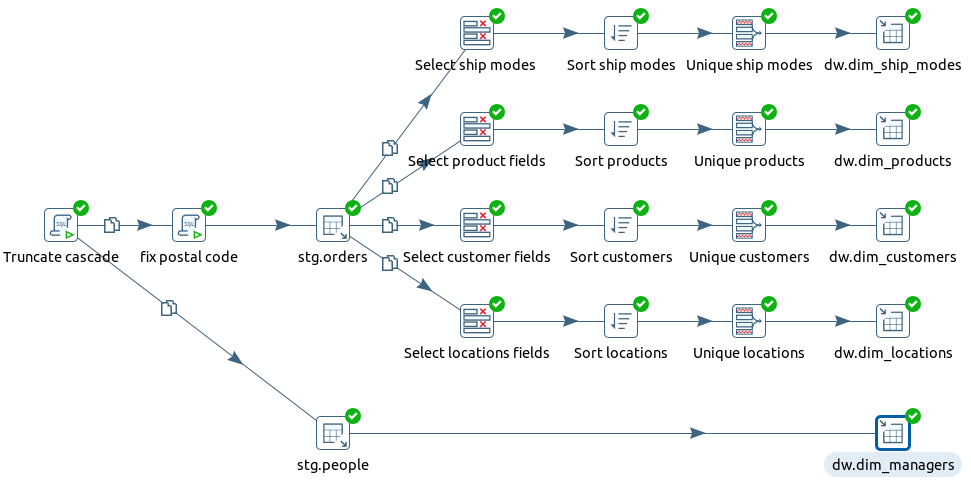
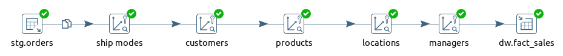
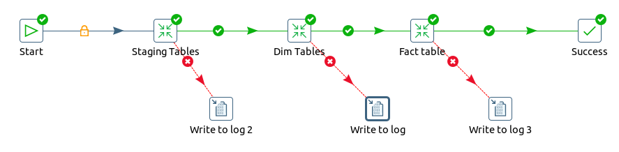

# Модуль 4

### 4.4: ETL Компоненты и начало работы с ETL на примере Pentaho Data Integration
Создайте трансформации, чтобы получить такой же результат, как в модуле 2:
* [загрузите данные из Superstore Excel файла в staging](./etl/staging.ktr)

  

* загрузить данные из staging-таблиц в dwh
    * [dim tables](./etl/dwh_dim.ktr)

  
    * [dim tables](./etl/fact_table.ktr)

      
Создайте общее [задание](./etl/stg_to_dwh.kjb) для выполнения всех трансформаций

