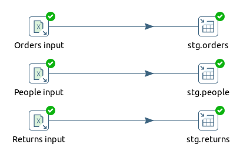
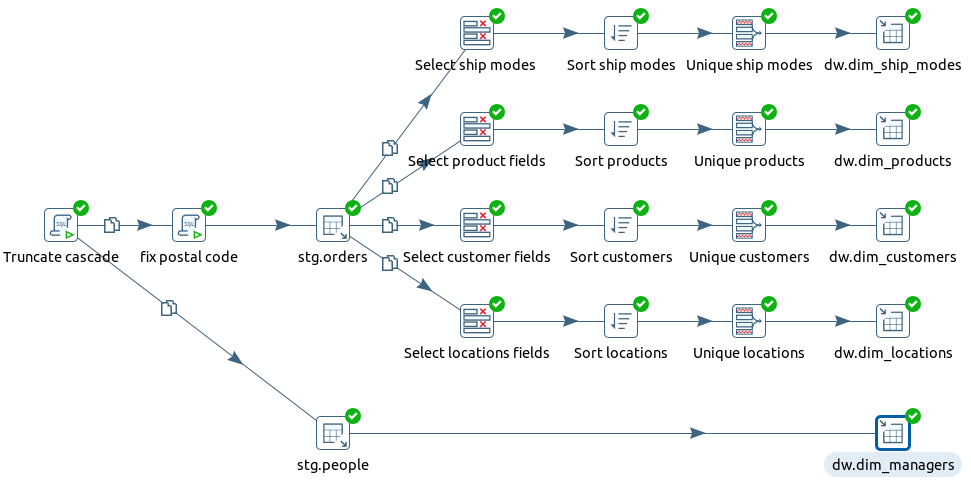
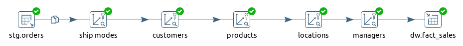
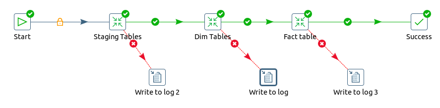

# Модуль 4

### 4.4: ETL Компоненты и начало работы с ETL на примере Pentaho Data Integration
Создайте трансформации, чтобы получить такой же результат, как в модуле 2:
* [загрузите данные из Superstore Excel файла в staging](4.4/etl/staging.ktr)

  

* загрузить данные из staging-таблиц в dwh
    * [dim tables](4.4/etl/dwh_dim.ktr)

  
    * [fact table](4.4/etl/fact_table.ktr)

      
Создайте общее [задание](4.4/etl/stg_to_dwh.kjb) для выполнения всех трансформаций

### 4.5: 34 ETL Подсистемы
В качестве практики вам необходимо выявить 8-10 подсистем в ETL Pentaho DI и написать небольшой [отчет](./4.5/subsystems.md), в котором вы приложите print screen компонента (ETL подсистемы) и напишите про его свойства.

